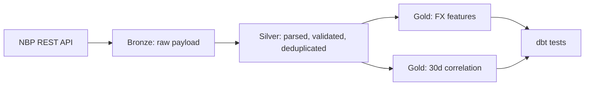
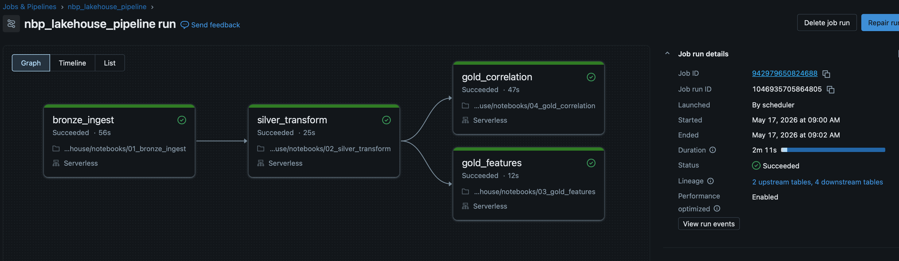
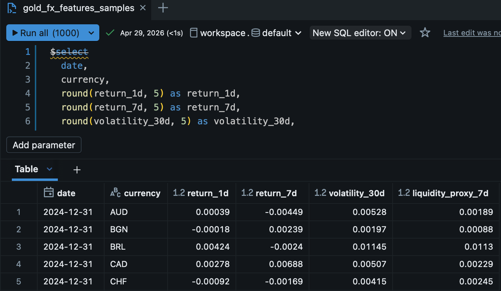
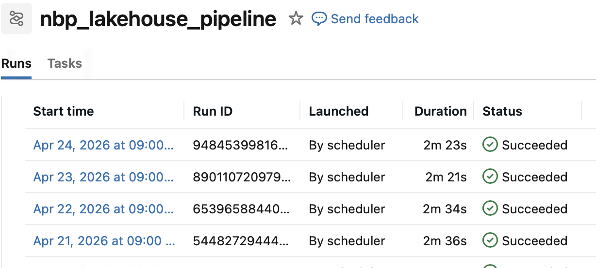
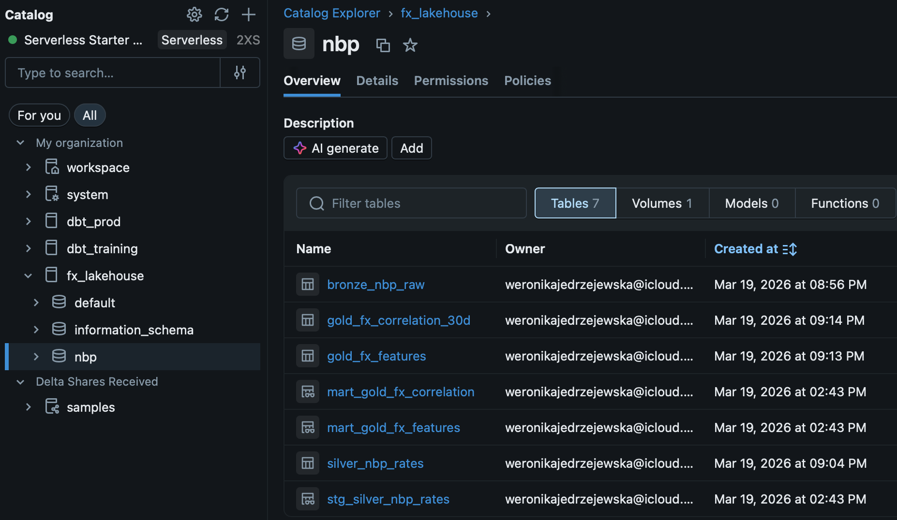
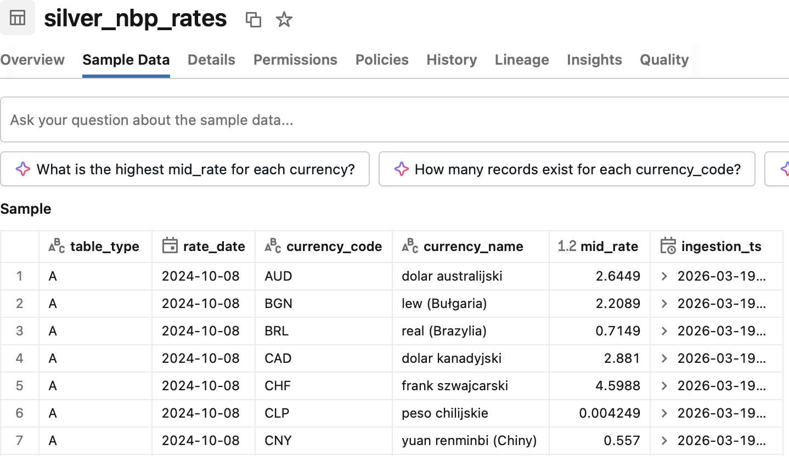
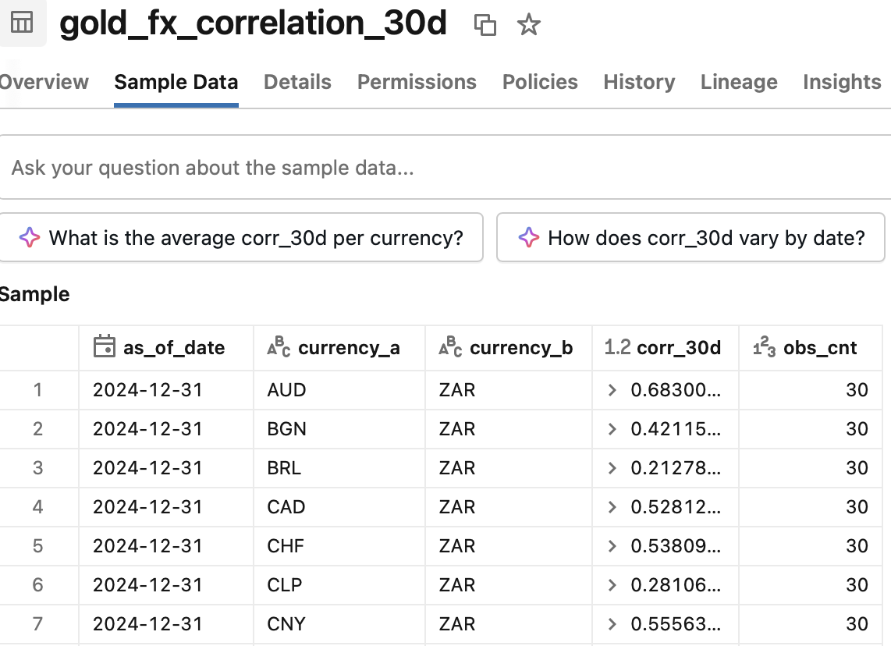
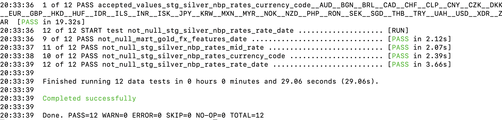

# NBP Exchange Rates Lakehouse (Databricks)

   

End-to-end data engineering pipeline built on Databricks, ingesting daily FX rates from the [NBP (National Bank of Poland) public REST API](https://api.nbp.pl/). Follows Medallion architecture (Bronze → Silver → Gold), stores data in Delta tables under Unity Catalog, orchestrated with Databricks Workflows, and validated with dbt tests plus local CI checks.

The project turns raw public exchange-rate data into analytics-ready Delta tables that can support BI reporting, currency monitoring, and ML-style feature engineering. Its main Gold output provides one row per currency per day with returns, rolling volatility, liquidity proxy, and reliability flags so downstream consumers can filter incomplete statistical windows explicitly.

## Key Highlights

- Databricks Lakehouse implementation using Delta Lake and Unity Catalog
- Medallion pipeline from raw API payloads to curated Silver and analytical Gold tables
- Incremental dbt marts for FX features and 30-day pairwise correlation snapshots
- Idempotent Silver merge logic with deterministic business keys
- Data quality controls for malformed payloads, invalid rates, missing dates, and duplicate rows
- Cross-layer reconciliation, idempotency, smoke, and edge-case tests in `pytest`
- Databricks Workflow orchestration with daily scheduling and dbt validation

## Architecture



## Pipeline Evidence

### Databricks Workflow



### Gold Features Output



<details>
<summary><strong>More Databricks and table evidence</strong></summary>

### Workflow Schedule & Run History



### Unity Catalog Tables



### Silver Layer Sample



### Gold Correlation Sample



</details>

## Output

FX analytics pipeline with reliable datasets for BI and ML-style feature engineering. The main output is one row per currency per day with computed returns, volatility, and reliability flags.

`date | currency | return_1d | return_7d | volatility_30d | volatility_reliable | liquidity_proxy_7d`

## Stack

| Layer | Technology |
|---|---|
| Compute | Databricks / PySpark |
| Storage | Delta Lake / Unity Catalog |
| Orchestration | Databricks Workflows |
| Transformation & Testing | dbt-databricks |
| Source | NBP REST API |
| CI | GitHub Actions + pytest + ruff |

## Catalog & Workflow

| Object | Name |
|---|---|
| Catalog | `fx_lakehouse` |
| Schema | `nbp` |
| Volume | `fx_lakehouse.nbp.landing` |
| Bronze table | `fx_lakehouse.nbp.bronze_nbp_raw` |
| Silver table | `fx_lakehouse.nbp.silver_nbp_rates` |
| Gold table | `fx_lakehouse.nbp.gold_fx_features` |
| Gold table | `fx_lakehouse.nbp.gold_fx_correlation_30d` |

Workflow order: **Bronze ingest → Silver transform → Gold features → Gold correlation → dbt tests**

## Databricks Deployment

The Databricks version is configured around Unity Catalog objects and a scheduled Workflow run:

- `fx_lakehouse.nbp.landing` stores raw JSONL extracts in a managed Volume
- Bronze ingestion loads the raw NBP payload into `bronze_nbp_raw` with source metadata
- Silver transformation parses, validates, deduplicates, and merges rates into `silver_nbp_rates`
- Gold tasks build `gold_fx_features` and `gold_fx_correlation_30d` for analytics use cases
- dbt runs against Databricks SQL Warehouse using `DATABRICKS_*` environment variables
- The Workflow is scheduled daily and executes the pipeline in dependency order

## Engineering Overview

- Idempotent Silver processing via deterministic merge keys
- Raw payload preservation in Bronze with full source traceability
- Multi-stage data quality filtering in Silver (`mid_rate > 0`, valid currency codes, non-null dates) with per-rejection-type metrics logged on every run
- Post-parse validation: malformed Bronze payloads raise immediately rather than silently producing NULLs
- SLA enforcement on ingestion: raises `ValueError` when more than 1 business day is missing from the API response
- Statistical reliability flags in Gold (`volatility_reliable`, `is_statistically_reliable`) — consumers can filter on these instead of guessing what a NULL means
- Cross-layer reconciliation tests: Bronze exploded row count → Silver minus rejections → Gold must tie out exactly
- Silver idempotency tests: re-running on the same Bronze input must not produce duplicate rows
- dbt range, freshness, and uniqueness tests as a second layer of validation independent of Python
- Delta tables managed in Unity Catalog
- Orchestration with Databricks Workflows (daily schedule, 4+ successful runs)
- Automated local quality checks with `ruff` and `pytest`
- CI pipeline on GitHub Actions for linting and test execution

## dbt Coverage

dbt models:

- `stg_silver_nbp_rates` — staging view over Silver
- `mart_gold_fx_features` — incremental merge materializing returns, volatility, and liquidity from Silver using window functions
- `mart_gold_fx_correlation` — incremental merge materializing 30-day pairwise FX correlation snapshots

Both mart models use `materialized='incremental'` with `unique_key` merge strategy, so each run only processes new dates rather than recomputing the full history.

Tests:

- `not_null` on all critical fields
- `accepted_values` on currency codes (33 ISO codes)
- `dbt_utils.accepted_range` on `mid_rate` (must be > 0; warn if > 1000)
- `dbt_utils.accepted_range` on `return_1d`, `return_7d` (sanity bounds)
- `dbt_utils.accepted_range` on `corr_30d` (must be within [-1, 1])
- `dbt_utils.accepted_range` on `obs_cnt` (must be >= 1)
- unique combination tests on business keys
- freshness check on Silver (warn after 1 business day, error after 3)

dbt test summary from the recorded Databricks run:

| Metric | Result |
|---|---|
| Tests executed | 23 |
| Passed | 23 |
| Failed | 0 |
| dbt version | 1.11.8 |
| Validation scope | staging, Gold features, Gold correlation |

<details>
<summary><strong>dbt test run evidence</strong></summary>



</details>

## Testing Strategy

| Test layer | Purpose |
|---|---|
| `pytest` smoke test | Runs the local Bronze → Silver → Gold path without external services |
| Silver idempotency tests | Verifies reruns do not create duplicate business keys |
| Cross-layer reconciliation | Ties Bronze exploded rows, Silver accepted rows, rejections, and Gold outputs |
| Edge-case tests | Covers malformed payloads, SLA breaches, empty input, and invalid records |
| dbt tests | Validates Databricks tables with range, freshness, uniqueness, and accepted-value checks |

## Repository Structure

```text
src/
  ingestion/fetch_nbp_rates.py          # NBP API client + Bronze records
  transform/bronze_to_silver_delta.py   # Silver parsing, validation, merge upsert
  features/build_gold_features.py       # Gold FX feature table
  features/build_gold_correlation.py    # Gold 30d correlation snapshot
dbt/
  models/staging/stg_silver_nbp_rates.sql
  models/marts/mart_gold_fx_features.sql    # incremental merge
  models/marts/mart_gold_fx_correlation.sql # incremental merge
tests/
  test_pipeline_smoke.py                # full Bronze → Silver → Gold smoke test
  test_bronze_to_silver_delta.py
  test_fetch_nbp_rates.py
  test_gold_features.py
  test_gold_correlation.py
  test_silver_merge_idempotency.py      # re-run safety
  test_cross_layer_reconciliation.py    # row-count tie-out across layers
  test_data_quality_edge_cases.py       # malformed payloads, SLA breach, empty input
.github/workflows/ci.yml
```

<details>
<summary><strong>Layer Details</strong></summary>

### Bronze

Raw NBP API payloads are stored with ingestion metadata:

- `ingestion_ts`
- `source_url`
- `table_type`
- `effective_date`
- `raw_payload`

This preserves source traceability and provides a safe landing zone for schema changes.

### Silver

The Silver layer parses and flattens FX rates into one row per currency and date with:

- typed fields
- null filtering
- business-key deduplication
- rerun-safe merge logic

Business key: `table_type + rate_date + currency_code`

### Gold

**`gold_fx_features`**
- `return_1d`, `return_7d`
- `volatility_30d`
- `volatility_reliable` — True when rolling window has >= 10 observations
- `liquidity_proxy_7d`

**`gold_fx_correlation_30d`**
- `as_of_date`, `currency_a`, `currency_b`
- `corr_30d`, `obs_cnt`
- `is_statistically_reliable` — True when obs_cnt >= 10

</details>

<details>
<summary><strong>Architecture Trade-offs</strong></summary>

- `return_7d` is null for early observations when there is not enough history.
- `volatility_30d` is based on rolling observations, not strict calendar-day windows. Use `volatility_reliable` to filter rows with insufficient history.
- Correlation is implemented as a latest 30-observation snapshot, not a full daily historical series. Use `is_statistically_reliable` to identify pairs with insufficient data.
- Bronze ingestion in Databricks uses a file loaded to a Unity Catalog Volume because direct API access was restricted in the workspace environment.
- SLA threshold (`MAX_MISSING_BUSINESS_DAYS = 1`) is intentionally strict for a daily pipeline; adjust if the source API has known holiday gaps.

</details>

## How To Run

### 1. Install dependencies

```bash
python3.11 -m venv .venv
source .venv/bin/activate
python -m pip install -r requirements.txt
```

### 2. Generate raw NBP extract locally

```bash
python src/ingestion/fetch_nbp_rates.py \
  --start-date 2024-01-01 \
  --end-date 2024-03-31 \
  --output-jsonl data/bronze/nbp_raw.jsonl
```

### 3. Run the local Delta path

```bash
python src/transform/bronze_to_silver_delta.py \
  --bronze-path data/bronze/nbp_raw.jsonl \
  --silver-path data/delta/silver/nbp_rates

python src/features/build_gold_features.py \
  --silver-path data/delta/silver/nbp_rates \
  --gold-path data/delta/gold/fx_features_ml

python src/features/build_gold_correlation.py \
  --silver-path data/delta/silver/nbp_rates \
  --gold-path data/delta/gold/fx_correlation_30d
```

### 4. Configure dbt for Databricks SQL Warehouse

```bash
export DATABRICKS_HOST=...
export DATABRICKS_HTTP_PATH=...
export DATABRICKS_TOKEN=...
export DATABRICKS_CATALOG=fx_lakehouse
export DATABRICKS_SCHEMA=nbp
```

```bash
mkdir -p ~/.dbt
cp dbt/profiles.yml ~/.dbt/profiles.yml
cd dbt
dbt deps
dbt test
```

### 5. Local quality checks

```bash
python -m pip install -r requirements-dev.txt
make lint
make test
make smoke-test
```

The smoke test covers a full local Bronze → Silver → Gold path without any external services.
